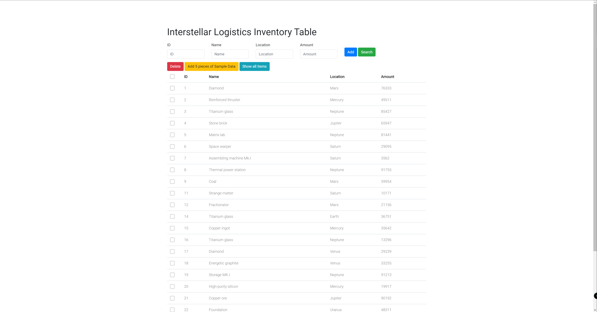

<div id="top"></div>

<!-- TABLE OF CONTENTS -->
<details>
  <summary>Table of Contents</summary>
  <ol>
    <li>
      <a href="#about-the-project">About The Project</a>
      <ul>
        <li><a href="#built-with">Built With</a></li>
      </ul>
    </li>
    <li>
      <a href="#getting-started">Getting Started</a>
      <ul>
        <li><a href="#prerequisites">Prerequisites</a></li>
        <li><a href="#installation">Installation</a></li>
      </ul>
    </li>
    <li><a href="#usage">Usage</a></li>
    <li><a href="#roadmap">Roadmap</a></li>
    <li><a href="#contact">Contact</a></li>
    <li><a href="#acknowledgments">Acknowledgments</a></li>
  </ol>
</details>


<!-- ABOUT THE PROJECT -->

## About The Project

### Screen Shot



### This project is for Shopify Challenge Summer Internship 2022

This website has 6 functions.


  <summary>Table of Contents</summary>
  <ol>
    <li>Create inventory items</li>
    <li>Edit items</li>
    <li>Delete items</li>
    <li>View a list of thems</li>
    <li>Add 5 Pieces of Sample Data</li>
    <li>Search</li>
    <ul>
        <li>Filtering based on id/name/location/amount</li>
    </ul>
  </ol>

<p align="right">(<a href="#top">back to top</a>)</p>

### Built With

* [Python](https://www.python.org/)
* [Flask](https://flask.palletsprojects.com/en/2.0.x/)
* [Flask-sqlalchemy](https://flask-sqlalchemy.palletsprojects.com/en/2.x/)
* [Bootstrap](https://getbootstrap.com)
* [JQuery](https://jquery.com)

<p align="right">(<a href="#top">back to top</a>)</p>


<!-- GETTING STARTED -->

## Getting Started

Here are steps to set up the project. You can use Python IDEs such as Pycharm or editors such as Sublime to run the project.

### Prerequisites

You need to make sure you have Python installed into your environment. To check if the requirement is satisfied, open
your cmd (Windows) or Terminal (macOS) and enter:

  ```sh
  python --version
  ```

Make sure you are using Python 3 instead of Python 2. If you don't have Python installed or installed with Python 2, you
need to go to [this](https://www.python.org/) link to install it.

### Installation

Below is an example of how you can install and set up this project.

1. Clone the repo
   ```sh
   git clone https://github.com/KarthusL/Shopify_Challenge.git
   ```
2. Install packages under the Shopify_Challenge folder
   ```sh
   pip install -r requirement.txt
   ```
3. Run run.py
   ```js
   python3 run.py
   ```

<p align="right">(<a href="#top">back to top</a>)</p>


<!-- USAGE EXAMPLES -->

## Usage

After running ```python run.py```, You will see a line
like ```Running on http://127.0.0.1:5000/ (Press CTRL+C to quit)``` in the Terminal or console, click the link, it will
bring you to the web browser.

For each function:
  <ol>
    <li>Create inventory items</li>
        <ul>
            You need to fill every box to add an item, a warning will be shown otherwise. The ID is the primary key, so no two items with same ID will be existed in the page (database).
        </ul>
    <li>Edit items</li>
        <ul>
            Click any blocks that you want to edit, then click OK to edit, click Cancel to cancel.
        </ul>
    <li>Delete items</li>
        <ul>
            Click the checkbox and click Delete button to delete items, multiple records deletion is supported.
        </ul>
        <ul>
            Delete same type of items is supported. For example, search "Coal" and click the checkbox on the left side of column name "ID" to delete all items with name "Coal". 
        </ul>
    <li>View a list of items</li>
        <ul>
            Show all items in the database.
        </ul>
    <li>Add 5 Pieces of Sample Data</li>
        <ul>
            Add 5 random items to the database. 
        </ul>
    <li>Search</li>
    <ul>
        <li>Filtering based on id/name/location/amount.</li>
    </ul>
  </ol>

Note: Item names are from a game named [Dyson Sphere Program](https://en.wikipedia.org/wiki/Dyson_Sphere_Program).


<p align="right">(<a href="#top">back to top</a>)</p>
<!-- ROADMAP -->

## Roadmap

- [ ] Add Pagination
- [ ] Add background to make it more like a Interstellar Logistics System
- [ ] Deploy the page using AWS EC2 and Linux Environment
- [ ] Ability to send a certain amount of items from a star to another (e.g. send from Earth to Mars and items are received in Mars from Earth)
- [ ] Multi-language Support
    - [ ] Chinese
    - [ ] Japanese
    

<p align="right">(<a href="#top">back to top</a>)</p>


<!-- CONTACT -->

## Contact

Yifu Liu - Please also view my [@personal_webpage](http://www.yifu-liu.com) - yl896@cornell.edu

Project Link: [https://github.com/KarthusL/Shopify_Challenge](https://github.com/KarthusL/Shopify_Challenge)

<p align="right">(<a href="#top">back to top</a>)</p>


<!-- ACKNOWLEDGMENTS -->

## Acknowledgments


* [All Dyson Sphere Prgram items](https://dsp-wiki.com/Items)

<p align="right">(<a href="#top">back to top</a>)</p>